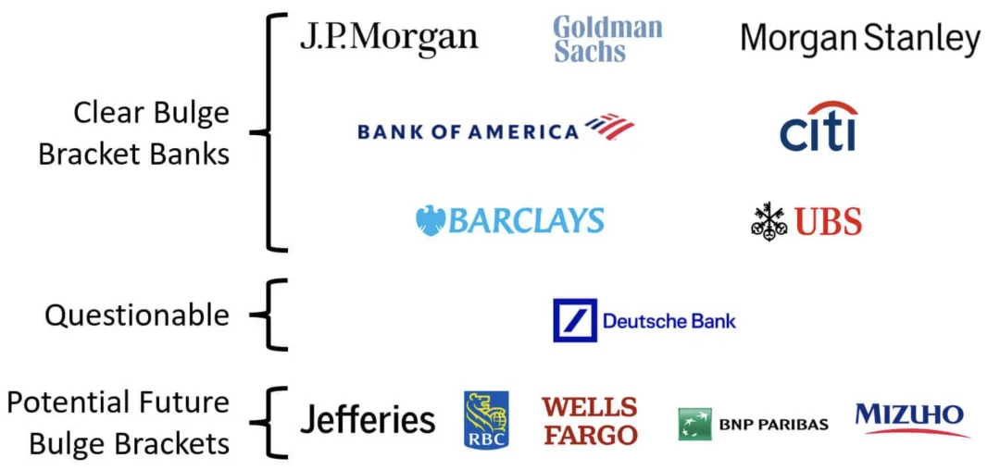

# 应届生梦中情司？12家顶级外资投行全览

在全球资本市场上，大型国际投行（“外资卖方”）以其强大的综合金融服务和跨地域布局而备受关注。它们通常活跃于投行业务、并购重组、资本市场、财富管理、证券研究等多个领域，服务对象涵盖政府、企业、机构以及个人。以下将从各大国际投行的背景、业务及特点入手，为读者梳理这份外资卖方全景图。

---

### 目录

1. [Goldman Sachs](#goldman-sachs)  
2. [Morgan Stanley](#morgan-stanley)  
3. [JPMorgan Chase](#jpmorgan-chase)  
4. [BofA Securities](#bofa-securities)  
5. [Citigroup](#citigroup)  
6. [Barclays](#barclays)  
7. [UBS](#ubs)  
8. [Deutsche Bank](#deutsche-bank)  
9. [BNP Paribas](#bnp-paribas)  
10. [HSBC](#hsbc)  
11. [Wells Fargo](#wells-fargo)  
12. [Jefferies Group](#jefferies-group)

---

## Goldman Sachs

高盛集团（The Goldman Sachs Group, Inc.）是一家美国跨国投资银行及金融服务公司，创立于1869年，总部位于纽约市曼哈顿下城的 200 West Street，并在伦敦、华沙、班加罗尔、香港、东京、达拉斯、盐湖城等地设有区域总部。按营收计，高盛是全球第二大投资银行，在美国《财富》500强中位列第55名，并被金融稳定理事会（Financial Stability Board）视为系统重要性金融机构。

**业务与特色**  

- **初创企业融资**：高盛会投资并为初创企业安排融资；这些企业在进行IPO时，高盛往往能获得更多相关业务。  
- **代表性IPO**：2013年，推特（Twitter）的上市由高盛作为主承销商之一；2021年也参与多家知名公司的IPO。  
- **投资组合**：其基金或公司层面曾投资 Spotify、Foodpanda、Dropbox 等初创企业。  
- **世界经济论坛合作组织**：高盛亦是世界经济论坛（WEF）的合作伙伴之一。

---

## Morgan Stanley

摩根士丹利（Morgan Stanley）是一家美国跨国投行与金融服务公司，总部位于纽约市曼哈顿中城百老汇大道1585号。截至目前，公司在41个国家拥有分支机构，雇员约7.5万人，客户包括企业、政府、机构与个人。摩根士丹利在2021年美国《财富》500强中排名第61位。

**业务结构**  

- **三大板块**：机构证券（Institutional Securities）、财富管理（Wealth Management）、投资管理（Investment Management）。  
- **功能**：通过其附属与子公司，摩根士丹利能为机构、政府及个人提供从承销、交易到资本配置、理财规划等全方位金融服务。

---

## JPMorgan Chase

摩根大通（JPMorgan Chase & Co.）是美国跨国金融服务公司，注册于特拉华州，总部位于纽约市。它是美国最大银行，也是按市值计算的全球最大银行（2023年数据），被金融稳定理事会认定为系统重要性金融机构。其庞大规模常伴随更严格的监管，以及维护内部“堡垒式资产负债表”的资本储备。公司目前总部在曼哈顿中城的麦迪逊大道383号，计划于2025年迁至在建的新大楼。

**核心优势与关注**  

- **资产规模**：总资产达3.67万亿美元，全球第五大银行。  
- **投行业务**：按营收计，为全球最大投行。  
- **排名**：在《财富》美国500强中列第24位。  
- **研究与影响**：在金融市场、经济、地缘政治及个人理财等方面提供机构研究，品牌忠诚度与市场占有率都较高；同时也因风险管理、融资活动、庞大法律和解等面临争议与质疑。

---

## BofA Securities

BofA Securities, Inc. 是美国银行（Bank of America）旗下的跨国投行部门，前称美银美林（Bank of America Merrill Lynch）。它与“美林”（Merrill）——美国银行的经纪及交易平台子公司——并不相同。

**合并历史**  

- **2009年1月**：美国银行收购美林，并将双方的公司和投行业务合并，形成今天的 BofA Securities。  
- **业务范围**：包括并购、股权和债券资本市场、贷款、交易、风险管理、研究、流动性与支付等服务。

---

## Citigroup

花旗集团（Citigroup Inc.，常称 Citi）是一家美国跨国投资银行及金融服务公司，总部位于纽约。该公司于1998年由 Citicorp（花旗银行）与金融综合集团 Travelers Group 合并而成，后者于2002年从花旗剥离。花旗在特拉华州注册。

**行业地位**  

- **美国第三大银行**：与摩根大通、美国银行、富国银行并称“四大行”。  
- **系统重要性**：由金融稳定理事会（FSB）认定为系统重要性银行；也常被外界称“大而不能倒”。  
- **投行业务**：花旗是全球“投行九大行”（Bulge Bracket）之一。

---

## Barclays

巴克莱（Barclays）是一家英国跨国综合银行，总部在伦敦，由 Barclays UK 和 Barclays International 两大业务构成，并有 Barclays Execution Services 来提供支持服务。

- **Barclays UK**：包括零售银行、信用卡、财富管理，以及英国企业银行。  
- **Barclays International**：由巴克莱企业与投行（原巴克莱资本）以及消费者、卡与支付业务组成。投行主要为大型企业、机构和政府客户提供咨询、融资与风险管理等，是英债、美债及欧洲多国国债的一级交易商。

---

## UBS

瑞银集团（UBS Group AG）是一家总部在瑞士（苏黎世和巴塞尔）的跨国投行与金融服务公司，也是瑞士规模最大、全球规模领先的私人银行。因在美洲、欧洲、中东及亚太地区均有巨大业务，瑞银被视为系统重要性银行。

- **业务范围**：除私人银行外，UBS 也向个人、公司及机构客户提供财富管理、资产管理、投行业务。  
- **市场地位**：管理全球最多的私人财富，拥有众多亿万富豪客户；即便卖方业务有所收缩，仍在全球保持投资银行和主要做市商地位。  
- **争议**：由于银行保密法规严格，UBS也曾在美国、法国、德国、以色列及比利时等对避税调查的案件中成为焦点。

---

## Deutsche Bank

德意志银行（Deutsche Bank AG）是德国跨国投资银行及金融服务企业，总部在法兰克福，并在法兰克福证券交易所和纽约证券交易所双重上市。

- **历史与收购**：1870年创立；1929年收购 Disconto-Gesellschaft；1998年收购 Bankers Trust；2010年收购德意志邮政银行。  
- **规模**：截至2018年，其业务遍及58国，在欧洲、美洲及亚洲均有显著业务。  
- **DAX成分**：常被称为德国规模最大的银行，自2011年起被金融稳定理事会认定为全球系统重要性银行。

---

## BNP Paribas

法国巴黎银行（BNP Paribas）是一家跨国综合银行与金融服务控股公司，于2000年由巴黎国民银行（BNP）与百利商业银行（Paribas）合并而成，拥有约19万名员工，主营三大业务：商业、个人银行与服务（CPBS）、投资与保护服务（IPS）以及企业与机构银行（CIB）。

- **市场地位**：欧洲规模最大、全球第九大银行（按资产计），在2008年金融危机后跻身全球前五大银行之列。  
- **系统重要性**：被金融稳定理事会列为系统重要性银行；在《福布斯全球2000》中排名全球第33位。

---

## HSBC

汇丰控股（HSBC Holdings plc）是一家英国综合性银行及金融服务集团，总部在伦敦，与东亚有特殊历史和商业渊源，在全球范围内经营。汇丰是按总资产计（2021年底数据）欧洲规模最大的银行，高于法国巴黎银行。其托管资产和管理资产在业内亦规模可观。

- **业务网络**：覆盖六大洲64个国家和地区，服务约4000万客户。  
- **排名**：2023年时，在《福布斯》全球大型企业排名中列第20位。  
- **上市与指数**：在港交所、伦敦交易所双主板上市，为恒生指数与富时100指数成分股，也在纽交所及百慕大交易所挂牌。

---

## Wells Fargo

富国银行（Wells Fargo & Company）是一家美国跨国金融服务商，全球业务广泛，遍及35个国家，为超过7000万客户提供服务。金融稳定理事会将其列入系统重要性金融机构，与摩根大通、美国银行和花旗并称美国“四大行”。

- **投资产品**：通过子公司 Wells Fargo Investments, LLC 和 Wells Fargo Advisors, LLC 以及全美经纪商开展。  
- **投行部门**：Wells Fargo Securities (WFS) 总部设于夏洛特，在曼哈顿设交易场所，并在明尼阿波利斯、波士顿、休斯敦、旧金山、洛杉矶等地有区域办公室，海外布局在伦敦、香港、新加坡及东京。自2009年收购 Wachovia Securities 后成立 WFS，提供销售与交易、固定收益、外汇及利率、股票、并购、高收益、杠杆融资、股票承销、私募、贷款银团、风险管理以及公共金融服务。

---

## Jefferies Group

杰富瑞集团（Jefferies Group LLC）是一家美国跨国、独立的投资银行及金融服务企业，总部在纽约市。其业务包括向客户提供资本市场与财务顾问服务、机构经纪、证券研究以及资产管理，涵盖并购、重组以及其他财务顾问领域。公司“资本市场”业务同时包括其间接部分控股子公司 Jefferies High Yield Trading, LLC 的证券交易与投行活动。

---

## 关于量化求职的更多信息

欢迎关注微信公众号与知识星球

### 关于 LLMQuant

**LLMQuant** 由一群来自世界顶尖高校和量化金融从业人员组成的前沿社区，致力于探索人工智能（AI）与量化（Quant）领域的无限可能。我们的团队成员来自剑桥大学、牛津大学、哈佛大学、苏黎世联邦理工学院、北京大学、中科大等世界知名高校，外部顾问来自 Microsoft、HSBC、Citadel、Man Group、Citi、Jump Trading、国内顶尖私募等一流企业。  
欢迎加入知识星球获取内部资料。
