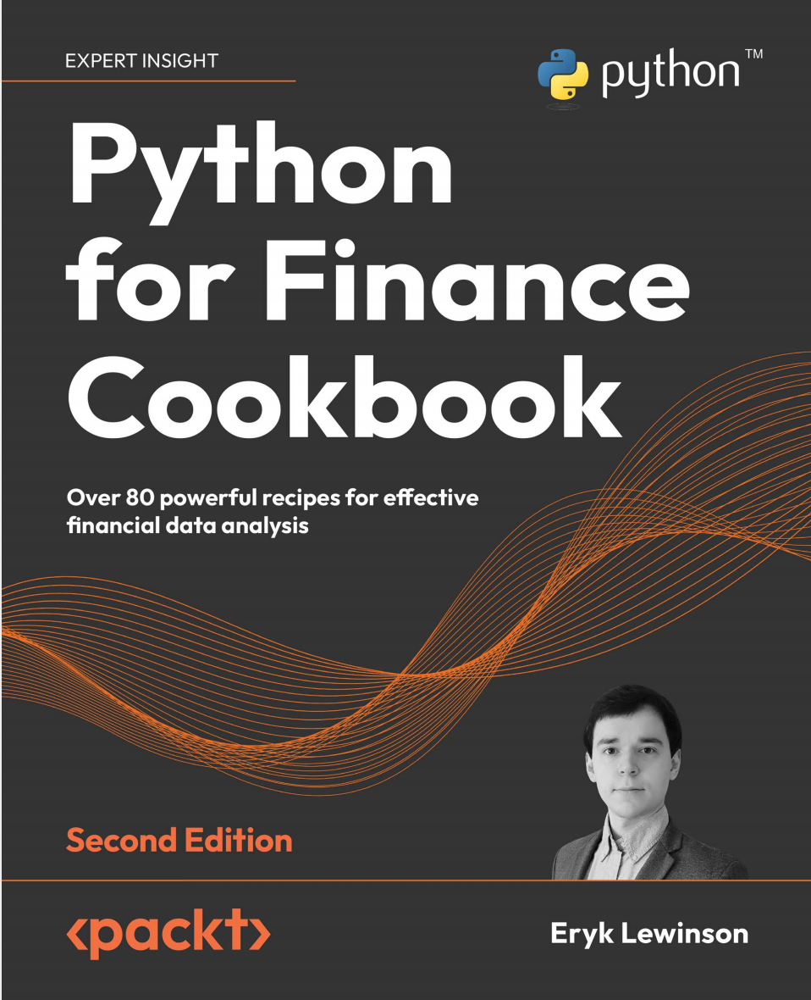
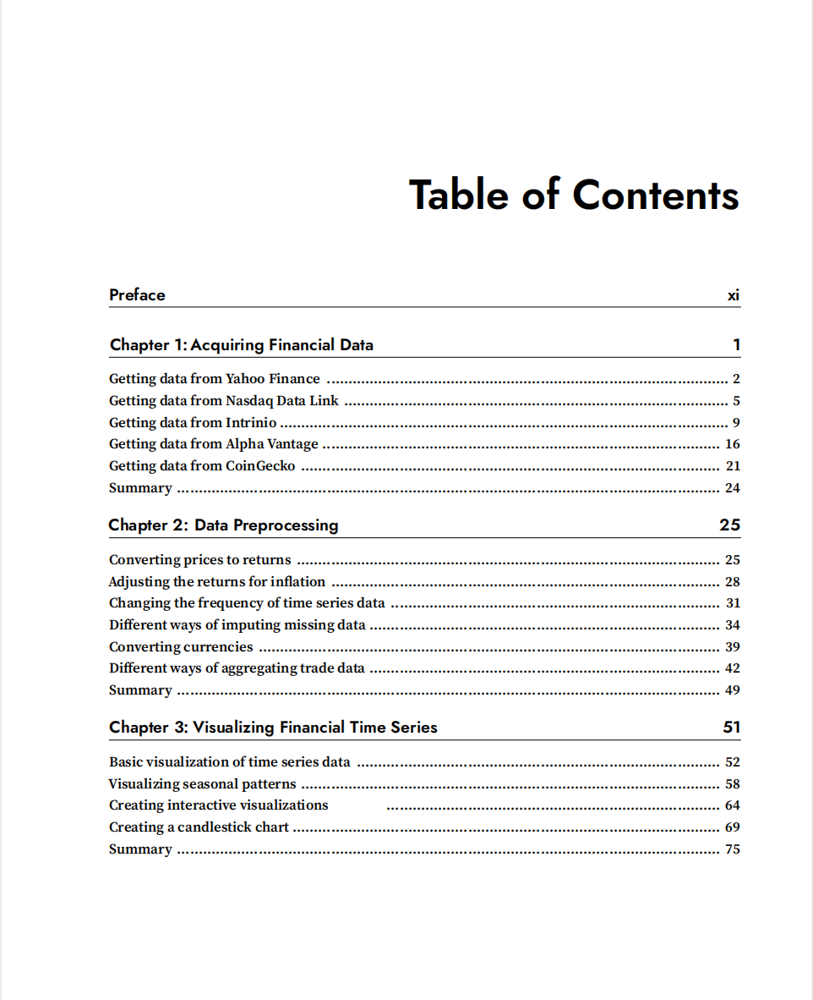
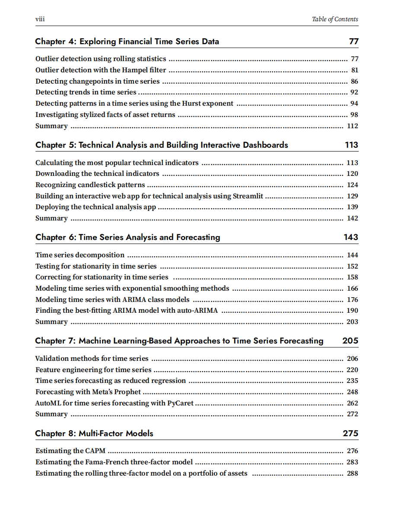
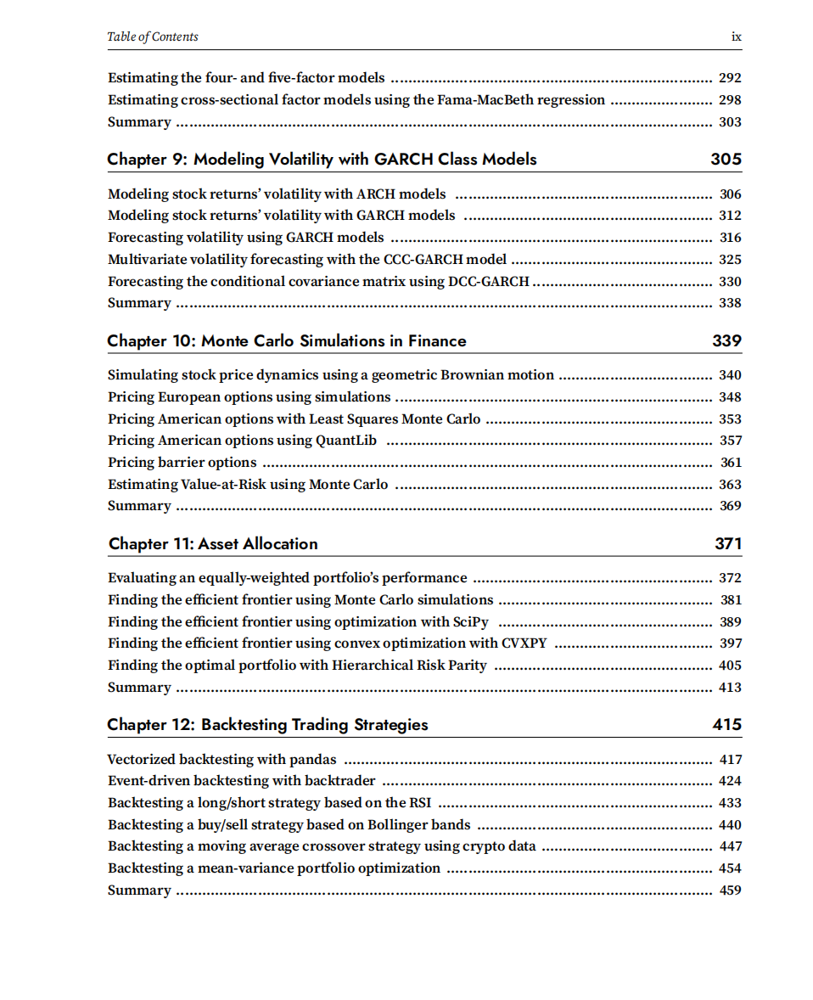
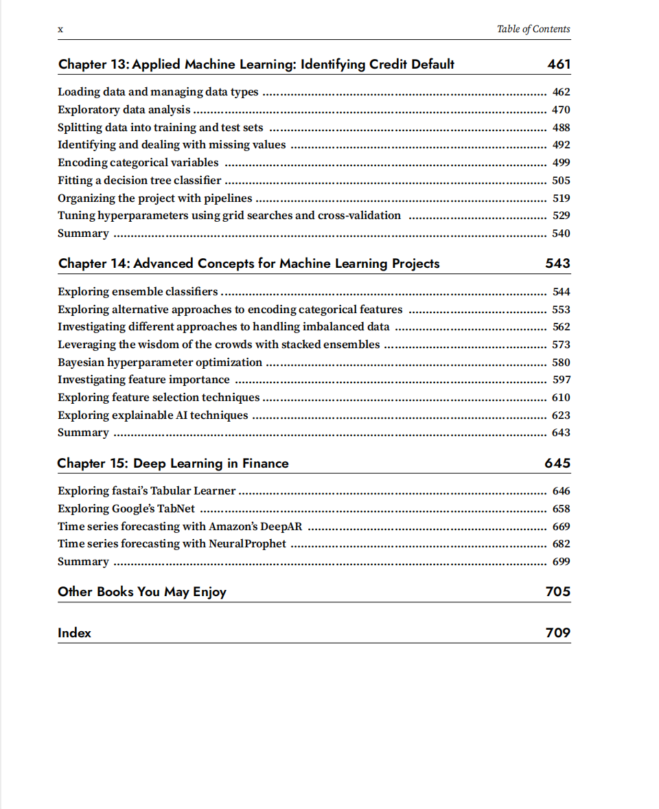

# Python for Finance Cookbook

本书籍由[LLMQuant社区](https://llmquant.com/)整理, 并提供PDF下载, 只供学习交流使用, 版权归原作者所有。

- **作者**:
- **出版社**:
- **出版年份**:
- **难度**: ⭐⭐⭐⭐
- **推荐指数**: ⭐⭐⭐⭐⭐
- **PDF下载**: [点击下载](https://github.com/LLMQuant/asset/blob/main/Python for Finance Cookbook_ Over 80 powerful recipes for effective financial data analysis, 2nd Edition.pdf)

### 内容简介

Python for Finance Cookbook 是一本关于量化金融的专业书籍，涵盖了...

### 核心章节

以下是本书的主要章节预览：

### 主要特点

- 理论与实践结合
- 包含详细示例
- 配套代码和资源
- 适合实际应用

### 适合人群

- 量化分析师
- 算法交易员
- 金融工程师
- 数据科学家

### 配套资源

- 示例代码
- 数据集
- 在线补充材料
