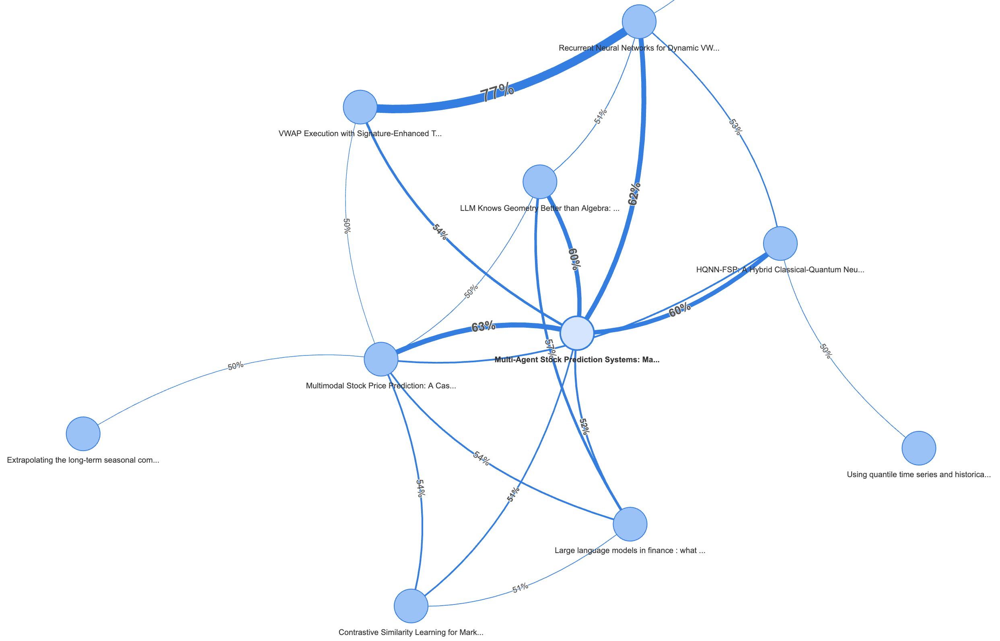

# LLMQuant 独家资源概览

欢迎了解 LLMQuant 提供的独家量化资源！我们致力于结合大型语言模型（LLM）与量化金融，为社区提供实用、前沿的工具与平台。以下是我们目前及未来计划推出的核心资源：

!!! note "我们的目标"
    LLMQuant 旨在利用 AI 的力量，降低量化研究和实践的门槛，促进知识共享与策略创新。

## **Quant Question**: 量化刷题平台

这是一个专为量化金融求职者设计的在线刷题平台。我们精心整理了大量行业内经典的面试题目，助您高效备战笔面试。🚩欢迎点击[网址](https://quantquestion.com/)进行试用。

???+ success "主要特点"
    * **免费真题:** 提供来自顶级公司（如 Jane Street）的真实面试题。
    * **经典题单:** 包含量化金融领域经典的“绿皮书”等题单。
    * **在线练习:** 提供便捷的在线答题和学习环境。
    * **持续更新:** 题库内容将不断丰富和更新。

## **Quant Scholar**: 开源 Knowledge Agent 项目 (开发中)

[Quant Scholar](https://github.com/LLMQuant/quant-scholar) 是一个正在运行中的 Agent 开源项目，旨在将量化金融领域的学术论文（未来会兼容更多领域）转化为结构化的数据，方便用户阅读、理解和利用。欢迎大家在 Github 上参与贡献。（以下是一个非常简单的 demo 展示）

???+ warning "当前状态与未来规划"
    * **核心功能:** 自动抓取、解析论文，并提取关键信息（如模型、数据集、结论等），形成结构化摘要。
    * **目标用户:** 论文阅读者；需要金融领域结构化文本作为 LLM Context 的 AI 应用人员。
    * **未来发展:**
        * **知识图谱:** 将结构化数据构建成知识图谱，揭示论文、作者、概念之间的关联。
        * **智能推荐:** 基于知识图谱和用户偏好，实现更精准的论文推荐。
        * **RAG 应用:** 将结构化论文数据作为 RAG (Retrieval-Augmented Generation) 的知识源，提供 API 和 MCP-Tool 等开源 Infra，提升 LLM 在量化领域的专业问答能力。

## **Quant Strategy**: 量化策略分享平台 (即将推出)

我们正在筹备一个量化策略分享平台 Quant Strategy，旨在促进社区成员之间的策略交流与学习。

???+ info "敬请期待"
    * **主要内容:** 分享量化策略的核心思想、实现逻辑、相关代码片段或完整代码。
    * **平台价值:**
        * 为策略开发者提供展示和交流的平台。
        * 帮助初学者和进阶者学习、借鉴不同的策略思路。
        * 促进社区共同构建和完善量化策略库。
    * **形式:** 可能包括策略文章、代码仓库链接、回测结果展示等。

我们相信这些工具将为量化社区带来独特的价值。欢迎您关注 LLMQuant 的进展，并参与到我们的开源项目中来！
