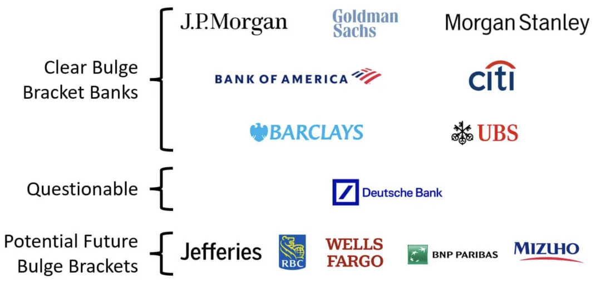

---
{}
---

# Dream Companies for New Graduates? A Complete Overview of 12 Top International Investment Banks

In global capital markets, major international investment banks ("foreign sell-side") are highly regarded for their comprehensive financial services and cross-regional presence. They typically operate across multiple areas including investment banking, mergers and acquisitions, capital markets, wealth management, and securities research, serving governments, corporations, institutions, and individuals. The following will provide readers with a panoramic view of these foreign sell-side institutions by examining their backgrounds, business operations, and distinctive characteristics.

---

### Table of Contents

1. [Goldman Sachs](#goldman-sachs)  
2. [Morgan Stanley](#morgan-stanley)  
3. [JPMorgan Chase](#jpmorgan-chase)  
4. [BofA Securities](#bofa-securities)  
5. [Citigroup](#citigroup)  
6. [Barclays](#barclays)  
7. [UBS](#ubs)  
8. [Deutsche Bank](#deutsche-bank)  
9. [BNP Paribas](#bnp-paribas)  
10. [HSBC](#hsbc)  
11. [Wells Fargo](#wells-fargo)  
12. [Jefferies Group](#jefferies-group)

---

## Goldman Sachs

The Goldman Sachs Group, Inc. is an American multinational investment banking and financial services company founded in 1869. Its headquarters is located at 200 West Street in Lower Manhattan, New York City, with regional headquarters in London, Warsaw, Bangalore, Hong Kong, Tokyo, Dallas, Salt Lake City, and other locations. By revenue, Goldman Sachs is the second-largest investment bank globally, ranks 55th on the Fortune 500 list, and is designated as a systemically important financial institution by the Financial Stability Board.

**Business and Characteristics**

- **Startup Financing**: Goldman Sachs invests in and arranges financing for startups; when these companies proceed with IPOs, Goldman Sachs often secures more related business opportunities.
- **Notable IPOs**: In 2013, Goldman Sachs served as one of the lead underwriters for Twitter's IPO; in 2021, it participated in IPOs of numerous well-known companies.
- **Investment Portfolio**: At both fund and corporate levels, it has invested in startups including Spotify, Foodpanda, Dropbox, and others.
- **World Economic Forum Partnership**: Goldman Sachs is also one of the partners of the World Economic Forum (WEF).

---

## Morgan Stanley

Morgan Stanley is an American multinational investment bank and financial services company headquartered at 1585 Broadway in Midtown Manhattan, New York City. Currently, the company has branches in 41 countries, employs approximately 75,000 people, and serves corporate, government, institutional, and individual clients. Morgan Stanley ranked 61st on the 2021 Fortune 500 list.

**Business Structure**

- **Three Main Divisions**: Institutional Securities, Wealth Management, and Investment Management.
- **Functions**: Through its affiliates and subsidiaries, Morgan Stanley provides comprehensive financial services ranging from underwriting and trading to capital allocation and financial planning for institutions, governments, and individuals.

---

## JPMorgan Chase

JPMorgan Chase & Co. is an American multinational financial services company, incorporated in Delaware with headquarters in New York City. It is the largest bank in the United States and the world's largest bank by market capitalization (as of 2023), designated as a systemically important financial institution by the Financial Stability Board. Its massive scale often comes with stricter regulatory oversight and the maintenance of an internal "fortress balance sheet" with capital reserves. The company's current headquarters is at 383 Madison Avenue in Midtown Manhattan, with plans to relocate to a new building under construction in 2025.

**Core Strengths and Focus Areas**

- **Asset Scale**: Total assets of $3.67 trillion, making it the fifth-largest bank globally.
- **Investment Banking**: The world's largest investment bank by revenue.
- **Ranking**: Ranked 24th on Fortune 500 list of U.S. companies.
- **Research and Influence**: Provides institutional research on financial markets, economics, geopolitics, and personal finance, with high brand loyalty and market share; simultaneously faces controversy and scrutiny over risk management, financing activities, and large legal settlements.

---

## BofA Securities

BofA Securities, Inc. is the multinational investment banking division of Bank of America, formerly known as Bank of America Merrill Lynch. It is distinct from "Merrill" - Bank of America's brokerage and trading platform subsidiary.

**Merger History**

- **January 2009**: Bank of America acquired Merrill Lynch and merged both companies' corporate and investment banking operations to form today's BofA Securities.
- **Business Scope**: Includes mergers and acquisitions, equity and debt capital markets, lending, trading, risk management, research, liquidity and payment services.

---

## Citigroup

Citigroup Inc. (commonly known as Citi) is an American multinational investment banking and financial services corporation headquartered in New York. The company was formed in 1998 through the merger of Citicorp and the financial conglomerate Travelers Group, with the latter spinning off from Citigroup in 2002. Citigroup is incorporated in Delaware.

**Industry Position**

- **Third Largest U.S. Bank**: One of the "Big Four" banks alongside JPMorgan Chase, Bank of America, and Wells Fargo.
- **Systemic Importance**: Designated as a systemically important bank by the Financial Stability Board (FSB); often referred to as "too big to fail."
- **Investment Banking**: Citigroup is one of the global "Bulge Bracket" banks (top nine investment banks).

---

## Barclays

Barclays is a British multinational universal bank headquartered in London, consisting of two main divisions - Barclays UK and Barclays International, with support services provided by Barclays Execution Services.

- **Barclays UK**: Includes retail banking, credit cards, wealth management, and UK corporate banking.  
- **Barclays International**: Comprises Barclays Corporate & Investment Bank (formerly Barclays Capital) and Consumer, Cards & Payments businesses. The investment bank primarily provides advisory, financing, and risk management services to large corporations, institutions, and government clients, and serves as a primary dealer for UK gilts, US treasuries, and various European government bonds.

---

## UBS

UBS Group AG is a multinational investment banking and financial services company headquartered in Switzerland (Zurich and Basel). It is Switzerland's largest bank and one of the world's leading private banks. UBS is considered a systemically important bank due to its substantial operations across the Americas, Europe, Middle East, and Asia Pacific regions.

- **Business Scope**: Besides private banking, UBS provides wealth management, asset management, and investment banking services to individuals, corporations, and institutional clients.  
- **Market Position**: Manages the largest amount of private wealth globally and serves numerous billionaire clients; maintains its position as a global investment bank and major market maker even after scaling back some sell-side operations.  
- **Controversies**: Due to strict banking secrecy laws, UBS has been at the center of tax evasion investigations in the United States, France, Germany, Israel, and Belgium.

---

## Deutsche Bank

Deutsche Bank AG is a German multinational investment bank and financial services company headquartered in Frankfurt, and is dual-listed on both the Frankfurt Stock Exchange and the New York Stock Exchange.

- **History and Acquisitions**: Founded in 1870; acquired Disconto-Gesellschaft in 1929; acquired Bankers Trust in 1998; acquired Deutsche Postbank in 2010.  
- **Scale**: As of 2018, its operations span 58 countries, with significant presence in Europe, Americas, and Asia.  
- **DAX Component**: Often referred to as Germany's largest bank, it has been designated as a global systemically important bank by the Financial Stability Board since 2011.

---

## BNP Paribas

BNP Paribas is a multinational banking and financial services holding company formed in 2000 through the merger of Banque Nationale de Paris (BNP) and Paribas. With approximately 190,000 employees, it operates three main business lines: Commercial, Personal Banking and Services (CPBS), Investment & Protection Services (IPS), and Corporate & Institutional Banking (CIB).

- **Market Position**: The largest bank in Europe and the ninth-largest bank globally (by assets), rising to become one of the world's top five banks after the 2008 financial crisis.
- **Systemic Importance**: Designated as a systemically important bank by the Financial Stability Board; ranked 33rd globally in the Forbes Global 2000.

---

## HSBC

HSBC Holdings plc is a British comprehensive banking and financial services group headquartered in London, with special historical and commercial ties to East Asia, operating globally. By total assets (as of end-2021), HSBC is Europe's largest bank, surpassing BNP Paribas. Its custody assets and assets under management are also substantial within the industry.

- **Business Network**: Covers 64 countries and regions across six continents, serving approximately 40 million customers.
- **Ranking**: As of 2023, ranked 20th in Forbes' Global 2000 list of largest companies.
- **Listing & Indices**: Dual-listed on Hong Kong Stock Exchange and London Stock Exchange, component stock of both Hang Seng Index and FTSE 100 Index, also listed on New York Stock Exchange and Bermuda Stock Exchange.

---

## Wells Fargo

Wells Fargo & Company is an American multinational financial services provider with extensive global operations across 35 countries, serving over 70 million customers. The Financial Stability Board has designated it as a systemically important financial institution, and it is considered one of the "Big Four" U.S. banks alongside JPMorgan Chase, Bank of America, and Citigroup.

- **Investment Products**: Conducted through subsidiaries Wells Fargo Investments, LLC and Wells Fargo Advisors, LLC, along with nationwide brokers.  
- **Investment Banking Division**: Wells Fargo Securities (WFS) is headquartered in Charlotte, with trading operations in Manhattan and regional offices in Minneapolis, Boston, Houston, San Francisco, Los Angeles, and other locations, as well as international presence in London, Hong Kong, Singapore, and Tokyo. Established after the 2009 acquisition of Wachovia Securities, WFS offers sales and trading, fixed income, foreign exchange and interest rates, equities, mergers and acquisitions, high yield, leveraged finance, equity underwriting, private placements, loan syndication, risk management, and public finance services.

---

## Jefferies Group

Jefferies Group LLC is an American multinational, independent investment banking and financial services company headquartered in New York City. Its business includes providing capital markets and financial advisory services, institutional brokerage, securities research, and asset management to clients, covering mergers and acquisitions, restructuring, and other financial advisory areas. The company's "Capital Markets" business also includes securities trading and investment banking activities through its partially-owned subsidiary, Jefferies High Yield Trading, LLC.

---

## More Information About Quantitative Finance Job Seeking

Follow us on WeChat Official Account and Knowledge Planet

### About LLMQuant

**LLMQuant** is a cutting-edge community composed of professionals from world-leading universities and quantitative finance practitioners, dedicated to exploring the unlimited possibilities in artificial intelligence (AI) and quantitative finance (Quant). Our team members come from renowned institutions including Cambridge University, Oxford University, Harvard University, ETH Zurich, Peking University, USTC, and other world-class universities. Our external advisors work at leading firms such as Microsoft, HSBC, Citadel, Man Group, Citi, Jump Trading, and top Chinese private funds.  
Welcome to join our knowledge community for access to internal resources.