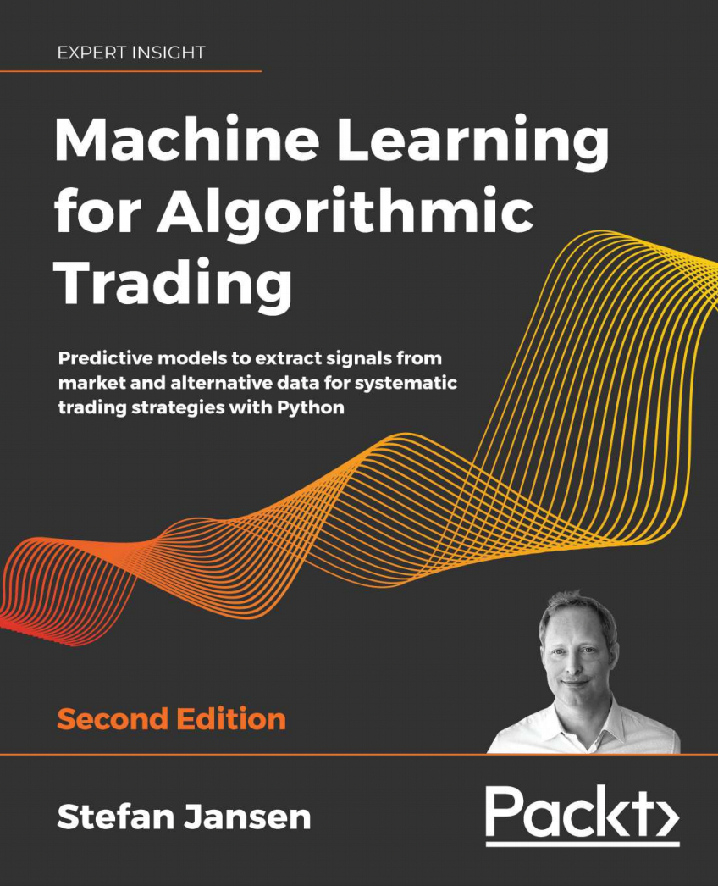
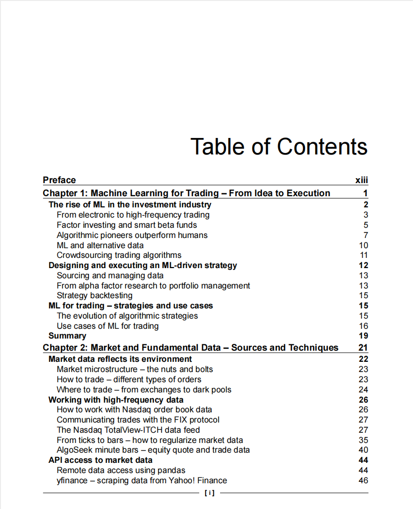
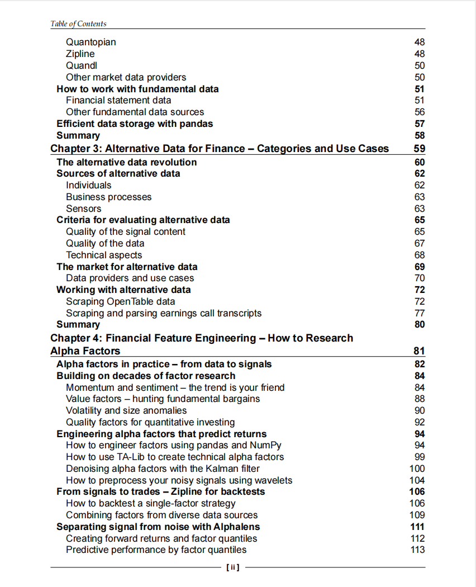
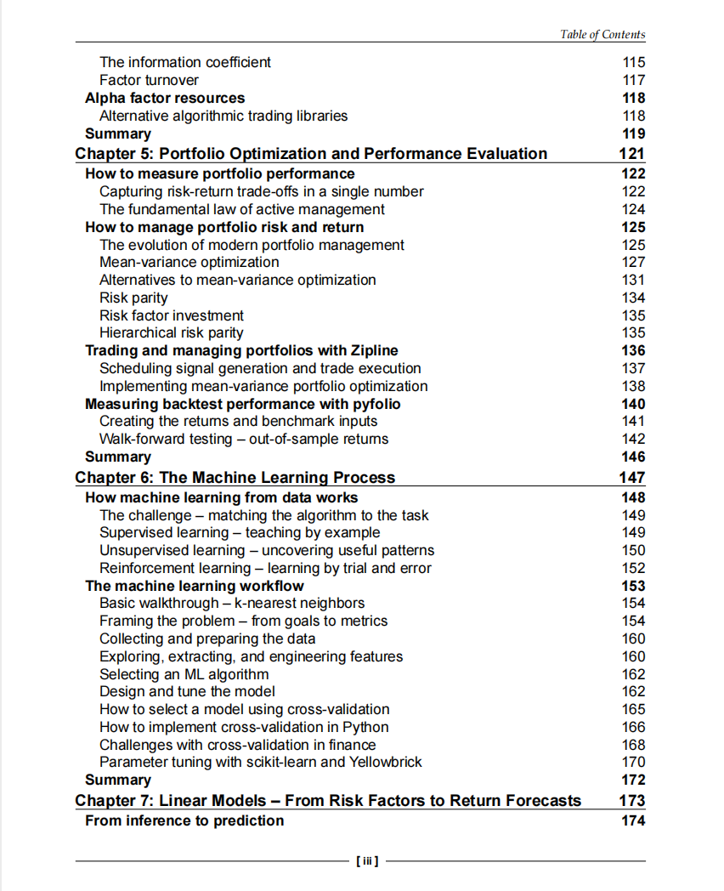
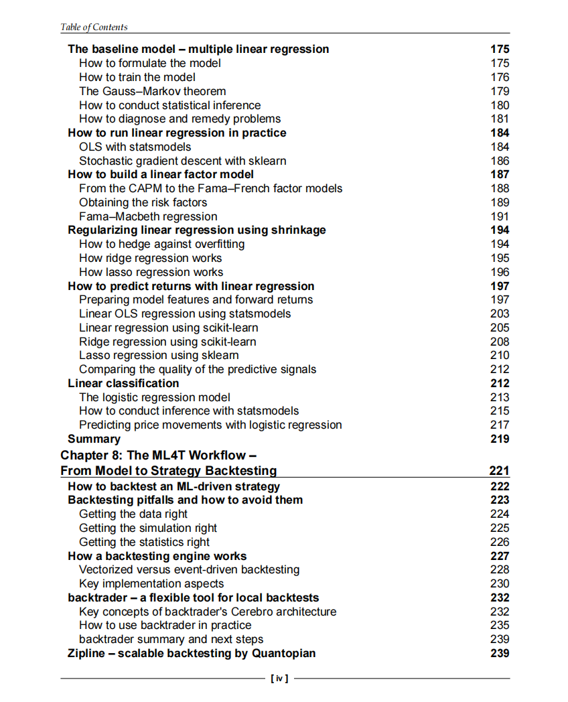
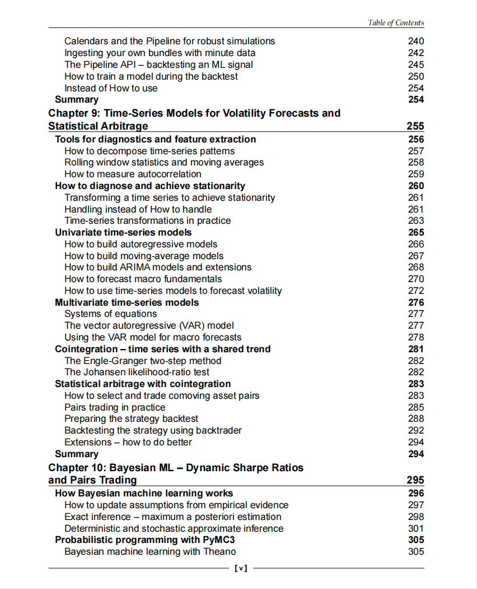
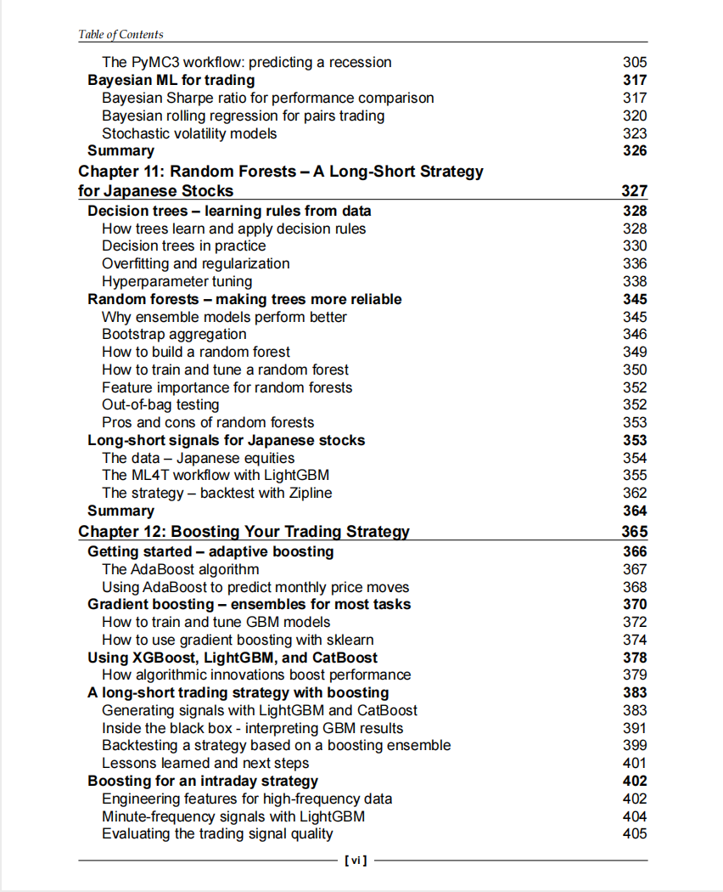
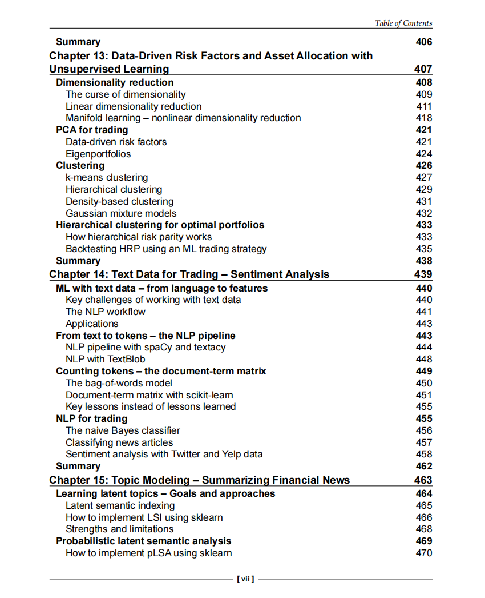
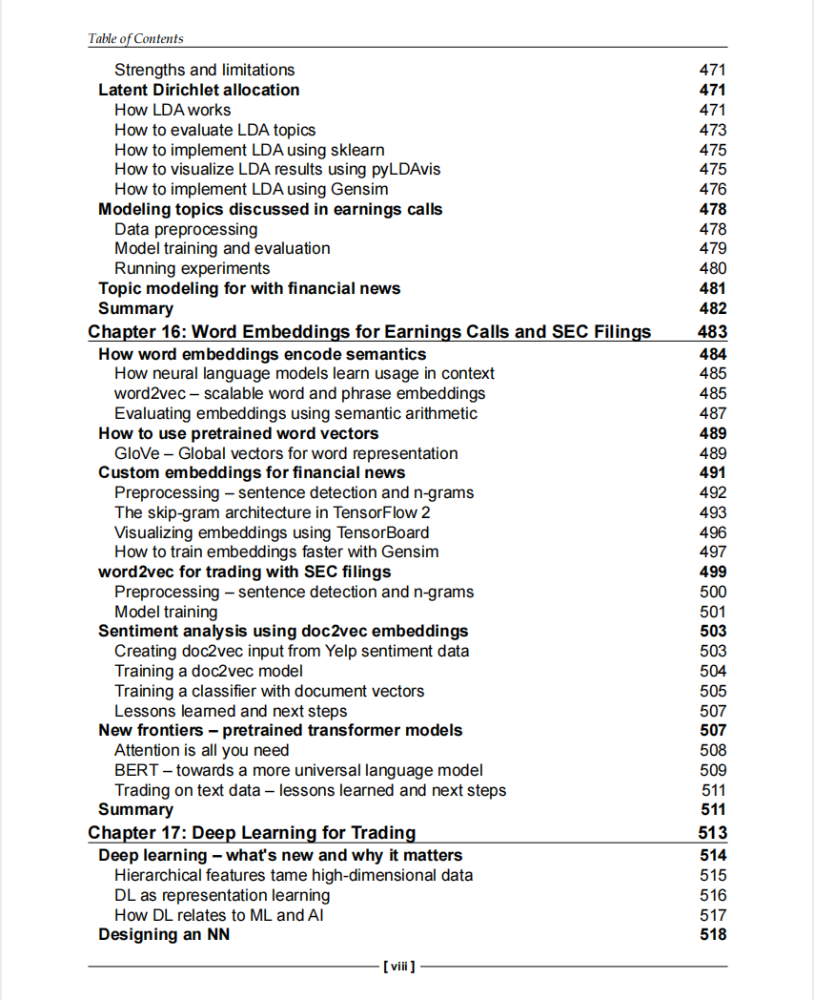

# Machine Learning for Algorithmic Trading

本书籍由[LLMQuant社区](https://llmquant.com/)整理, 并提供PDF下载, 只供学习交流使用, 版权归原作者所有。

- **作者**:
- **出版社**:
- **出版年份**:
- **难度**: ⭐⭐⭐⭐
- **推荐指数**: ⭐⭐⭐⭐⭐
- **PDF下载**: [点击下载](https://github.com/LLMQuant/asset/blob/main/Machine Learning for Algorithmic Trading.pdf)

### 内容简介

Machine Learning for Algorithmic Trading 是一本关于量化金融的专业书籍，涵盖了从基础理论到高级应用的广泛内容。书中详细介绍了机器学习在金融市场中的应用，包括数据预处理、特征工程、模型选择与优化等关键步骤。此外，书中还探讨了如何利用机器学习技术进行市场预测、风险管理以及投资组合优化等实际问题的解决方案。通过丰富的案例分析和实战演练，读者可以深入理解机器学习在量化交易中的实际应用，并掌握如何将这些技术应用于自己的交易策略中。无论是初学者还是经验丰富的量化交易员，这本书都提供了宝贵的知识和实用的工具，帮助他们在复杂的金融市场中获得竞争优势。

### 核心章节

以下是本书的主要章节预览：

### 主要特点

- 理论与实践结合
- 包含详细示例
- 配套代码和资源
- 适合实际应用

### 适合人群

- 量化分析师
- 算法交易员
- 金融工程师
- 数据科学家

### 配套资源

- 示例代码
- 数据集
- 在线补充材料
