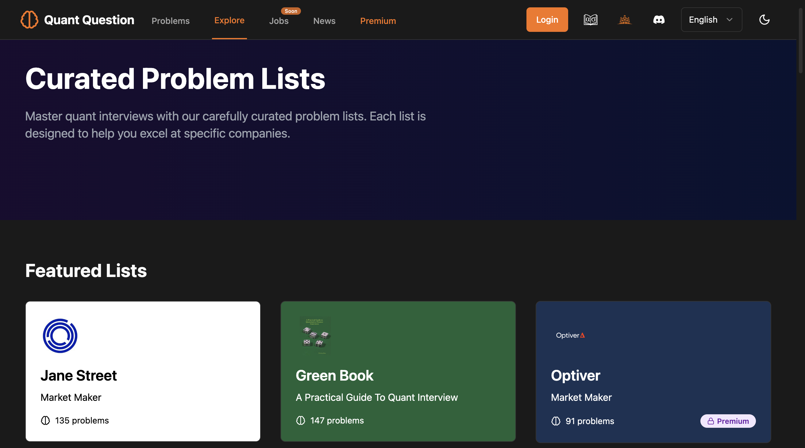
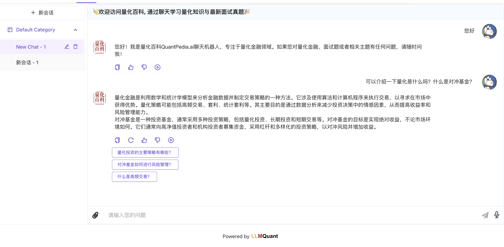
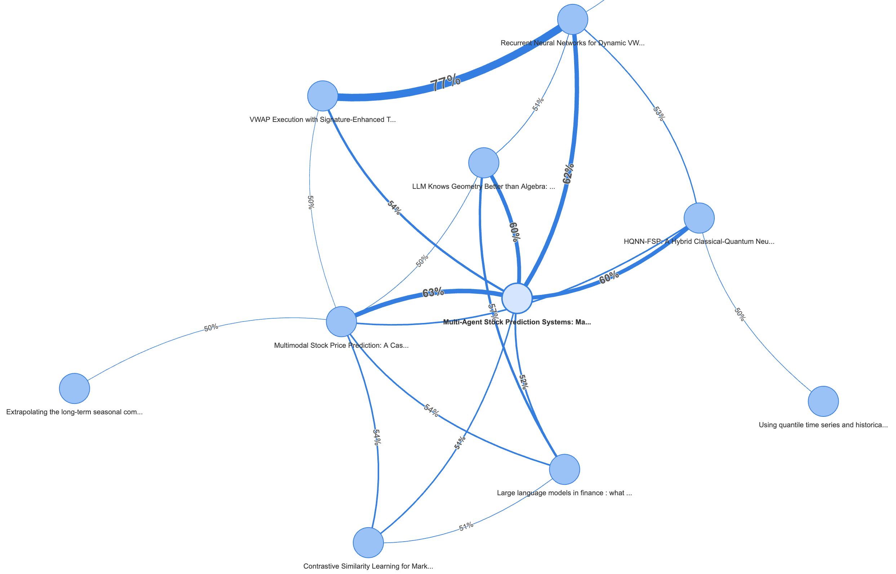

---
{}
---

# Overview of LLMQuant Exclusive Resources

Welcome to explore LLMQuant's exclusive quantitative resources! We are dedicated to combining Large Language Models (LLM) with quantitative finance to provide practical and cutting-edge tools and platforms for the community. Here are our current and planned core resources:

!!! note "Our Mission"
    LLMQuant aims to leverage the power of AI to lower the barriers to quantitative research and practice, promoting knowledge sharing and strategy innovation.

## **Quant Question**: Quantitative Practice Platform

This is an online practice platform designed specifically for quantitative finance job seekers. We have carefully curated numerous classic interview questions from the industry to help you efficiently prepare for written tests and interviews. 🚩 Visit [quantquestion.com](https://quantquestion.com/) to try it out.

???+ success "Key Features"
    * **Free Real Questions:** Provides real interview questions from top companies (like Jane Street).
    * **Classic Question Sets:** Includes classic "Green Book" and other question sets from quantitative finance.
    * **Online Practice:** Offers convenient online answering and learning environment.
    * **Regular Updates:** Question bank content is continuously enriched and updated.

## **QuantPedia.ai**: Quantitative Encyclopedia Chatbot
To facilitate easier interaction with the quantitative encyclopedia and access to the latest quantitative knowledge through chat, we developed the QuantPedia.ai chatbot.
🚩 Visit [quantpedia.ai/](https://quantpedia.ai/) to try it out.

???+ success "Key Features"
    * **Powerful Capabilities:** Based on the latest AI models, users can upload questions to get answers.
    * **Carefully Curated:** We provide carefully curated interview questions and answers from top domestic and international hedge funds and investment banks. Users can access these in question format (e.g., "Please provide the latest interview practice questions and answers from xxx").
    * **Personalized Guidance:** Our chatbot not only provides detailed solutions and analysis but also offers personalized guidance based on your needs to help you better prepare for interviews and enhance competitiveness.
    * **Regular Updates:** Content is continuously enriched and updated.

## **Quant Scholar**: Open Source Knowledge Agent Project (In Development)

[Quant Scholar](https://github.com/LLMQuant/quant-scholar) is an ongoing Agent open-source project aimed at transforming academic papers in quantitative finance (and more fields in the future) into structured data for easy reading, understanding, and utilization. Everyone is welcome to contribute on Github. (Below is a simple demo)

???+ warning "Current Status and Future Plans"
    * **Core Functions:** Automatically crawl and parse papers, extract key information (such as models, datasets, conclusions, etc.), and form structured summaries.
    * **Target Users:** Paper readers; AI application developers needing financial domain structured text as LLM Context.
    * **Future Development:**
        * **Knowledge Graph:** Build structured data into knowledge graphs, revealing connections between papers, authors, and concepts.
        * **Intelligent Recommendations:** Implement more precise paper recommendations based on knowledge graphs and user preferences.
        * **RAG Applications:** Use structured paper data as knowledge source for RAG (Retrieval-Augmented Generation), provide APIs and MCP-Tool open-source infrastructure to enhance LLM's professional Q&A capabilities in quantitative fields.

## **Quant Strategy**: Quantitative Strategy Sharing Platform (Coming Soon)

We are preparing a quantitative strategy sharing platform, Quant Strategy, aimed at facilitating strategy exchange and learning among community members.

???+ info "Stay Tuned"
    * **Main Content:** Share core ideas, implementation logic, related code snippets, or complete code of quantitative strategies.
    * **Platform Value:**
        * Provides a platform for strategy developers to showcase and exchange ideas.
        * Helps beginners and advanced users learn from different strategy approaches.
        * Promotes community collaboration in building and improving the strategy library.
    * **Format:** May include strategy articles, code repository links, backtest result demonstrations, etc.

We believe these tools will bring unique value to the quantitative community. Welcome to follow LLMQuant's progress and participate in our open-source projects!